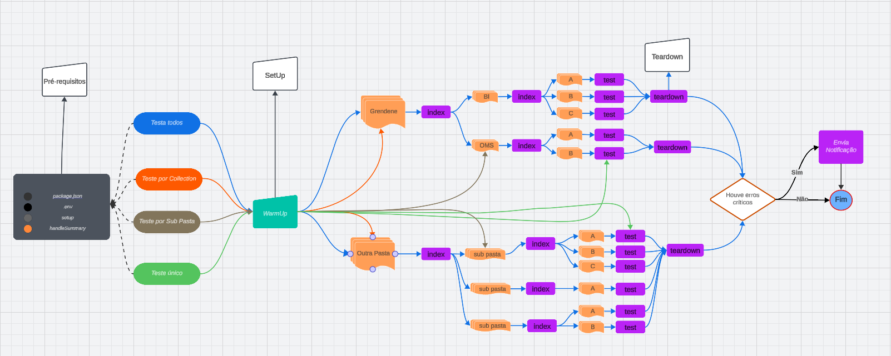
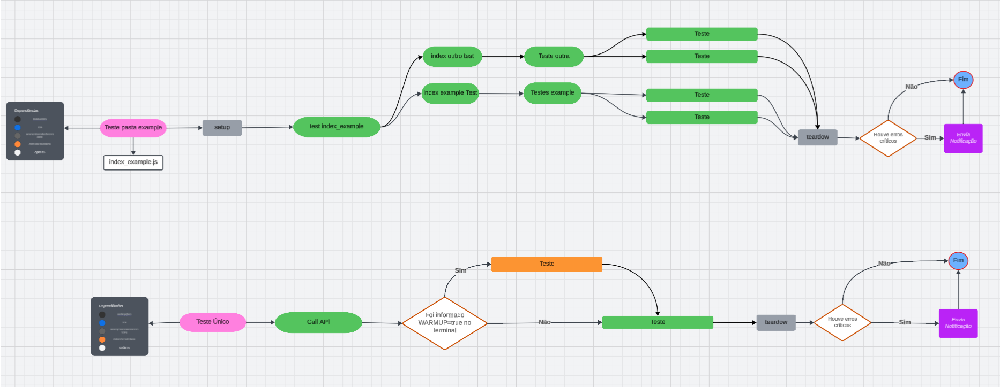

## Documentação de Testes de API com k6
> Documento destinado a explicar os teste de API com k6, divisão de pastas, criação de novos testes, etc.   

### 1. Pré-requisitos
- Node.js
- k6
- dotenv - Instalação: [dotenvx.com/docs/install](https://dotenvx.com/docs/install))

Para verificar se o k6 está instalado, execute:
```sh
k6 --version
```

---

### 2. Configuração do Ambiente

#### 2.1 Arquivo `.env`
Na raiz do projeto, há um arquivo `.env.example` com exemplos de variáveis de ambiente usadas nos testes. 
Crie um arquivo `.env` na raiz do projeto e ajuste conforme necessário.  

Credênciais devem ficar nesse arquivo, ele está no `.gitignore`.

---

### 3. Estrutura de Arquivos

#### 3.1 `index.js`
O `index.js` funciona como um ponto de entrada para execução de todos os testes, chamando os arquivos `index_pasta.js` de cada pasta de testes

#### 3.2 `index_pasta.js`
Cada pasta de teste deve ter um arquivo `index_nome_da_pasta.js`, que executa todos os testes dentro da pasta correspondente.

#### 3.3 `resources/`
Cada teste deve estar dentro de uma pasta com o respectivo nome e um arquivo `arquivo_test.js`, caso necessário arquivos para utilizar no teste, pode ser criado
uma pasta `resources/` para inclusão de arquivos, como validador de schemas;

#### 3.4 `schema_validator`:
Pegue o json retornado e crie um schema como pelo site https://transform.tools/json-to-json-schema, altere conforme necessário.

Exemplo de arquivo de schema:
```javascript
export const nome_schema = {
  // aqui vai o schema
}

export default {
  nome_schema
}
```

Uso:
```javascript
import { nome_schema } from './resources/nome_schema.js';

let responseBody = JSON.parse(response.body);

if (!isNullOrEmpty(responseBody.results)) {
    describe('Valida Schema', (t) => {
        t.expect(results).toMatchAPISchema(nome_schema);
    });
}
```

#### 3.5 `package.json`
Arquivo contendo scripts de execução dos testes.

O script deve apontar para os arquivos de teste, que pode ser um teste específico um uma pasta de teste.

Exemplo:
```json
"scripts": {
  "test:index": "dotenv -e .env k6 run ./index.js",
  "test:index_pasta": "dotenv -e .env k6 run ./api/projeto/index_nome.js",
  "test:meu_test": "dotenv -e .env k6 run ./api/projeto/pasta/meu_test/test.js"
}
```

#### 3.6 `utils/`
Contém funções reutilizáveis e uma pasta `resources/` para armazenar arquivos compartilhados.

#### 3.7 `k6_utils/`
Aglutinador de funções de validação do k6, com tratativas de erros e melhor legibilidade.  
Deve ser importado sem `./`.

Exemplo: `import { isNullOrEmpty } from '/utils/k6_utils.js'`;

Algumas funções:
- `checkStatusResponse`;   
- `maxDurationResponse`;   
- `checkEquals`;   
- `checkNotEquals`;   
- `checkNull`;   
- `checkNotNull`;   
- etc.


#### 3.8 `reports/`
Usada para salvar relatórios de teste e publicação no Azure DevOps.

#### 3.9 `common_config.js`
Arquivo de configurações gerais de métricas. Se as métricas não forem atingidas, notifica.

#### 3.8 `scripts/`
Para aglutinar scripts uteis nos testes, como a criação de link de import.
Antes de executar os testes no localhost, deve ser adicionado perissão de execução para o arquivo de setup de links e executa-lo.
---

### 4. Notificações
Os testes podem enviar notificações para Telegram ou Teams.   
Para que seja realizado a verificação se deve ser notificado ou não, é necessário que o teste execute o setup e o teardown padrão.   
Configurações:
- `_SEND_NOTIFICATION_`: Defina como `false` para desativar notificações.
- `_NOTIFY_ON_SUCCESS_`: Defina como `true` para notificar mesmo quando não houver falhas.

---

### 5. Estrutura de Diretórios

```
projeto/
├── k6/                          # Diretório principal
├──── api/                       # Testes divididos por funcoes
├────── cliente/
├────── index_cliente.js
├──────── bi/                    # Serviços de 'bi'
├────────── index_bi.js
├────────── analise_dados/      
├──────────── pedidos/
│               ├── resources/
│               ├── pedidos_test.js
├──────── outros/                # Outros serviços 
├──────────── outros/
│               ├── resources/
│               ├── outros_test.js
├──── utils/
├───── resources/
├── index.js
└── package.json
```

---

## Fluxo da Pipeline

##### Execução completa:


##### Execução por pasta:



